# Access Control System (ACS)

## Overview
This project uses the Tiva C EK-TM4C123GXL board to build an ACS (Access Control System) using RFID. The firmware uses [FreeRTOS](https://www.freertos.org/), and is an example of a soft real-time system.

Like previous similar projects using RFID such as automatic door lock, parking lot access system, etc. This project mainly focuses on applying RFID to unlock something which I am using here is an electric lock for example purpose. Users will use RFID tags to scan when entering/leaving a certain area. If the card is valid, the lock will open. On the contrary, the buzzer will howl to warn of refusal. LEDs and LCDs will also have corresponding behavior.

This project was designed by me, in the AESD subject. From HCMUT with love, peace!

## Images

### ACS
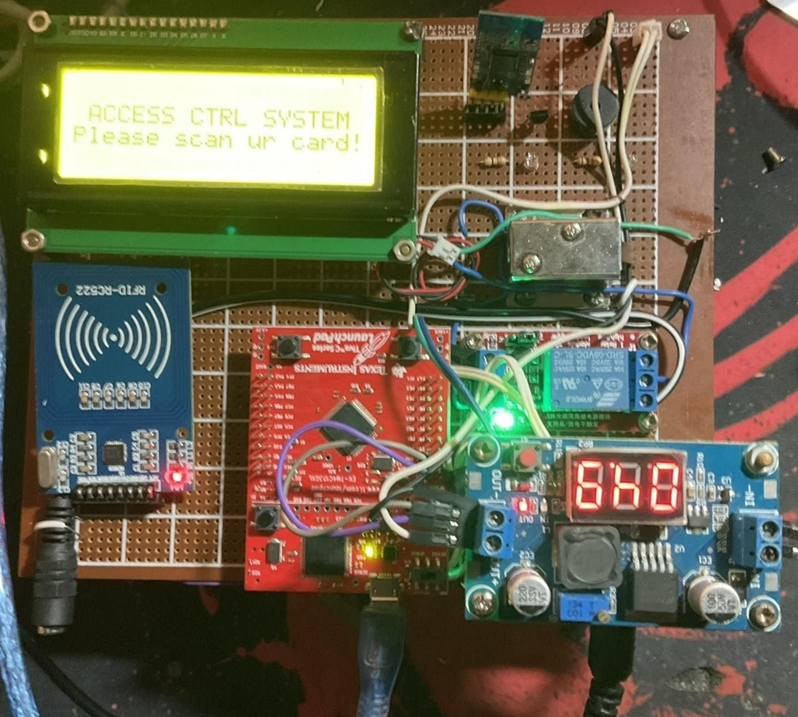
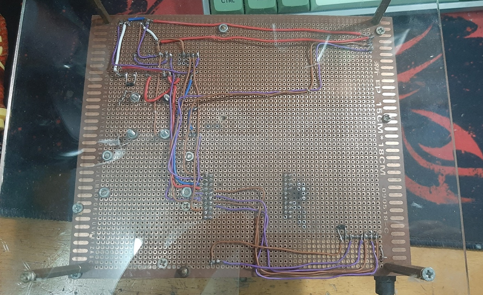

### Circuit Diagram
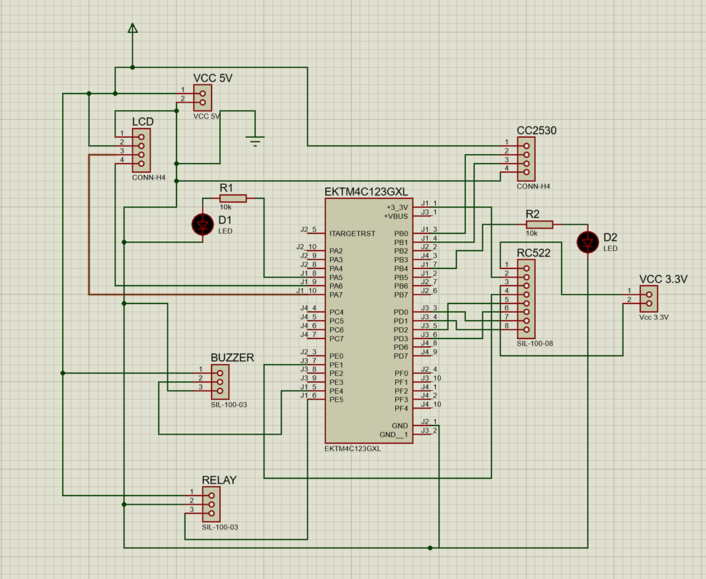

### MainDashboard
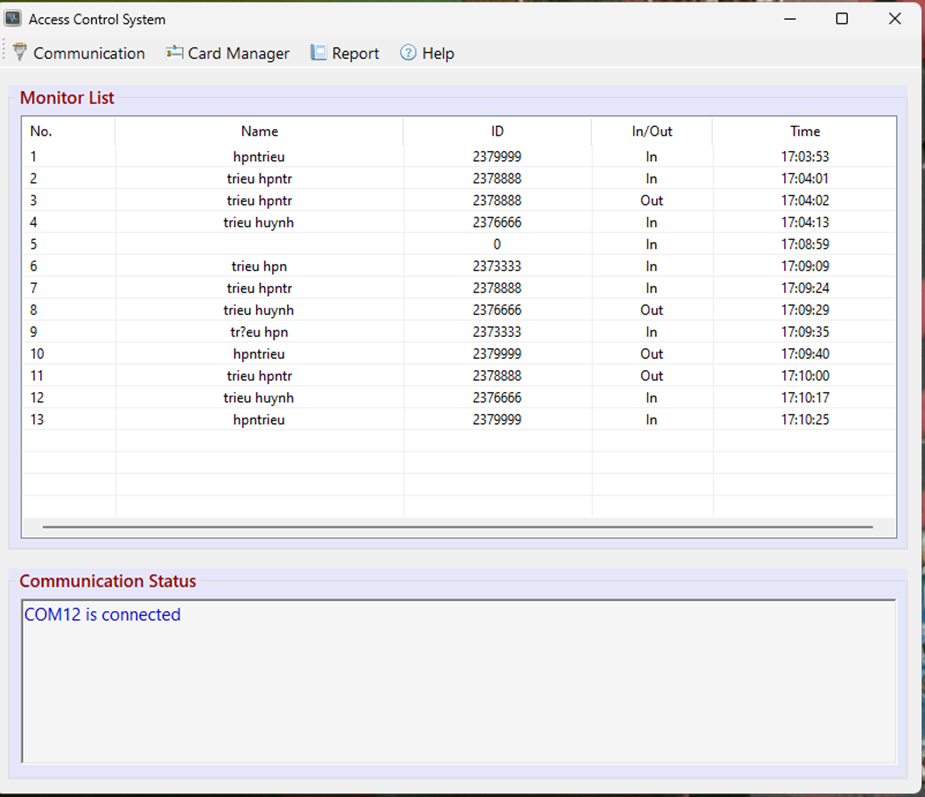

### COMSettingForm
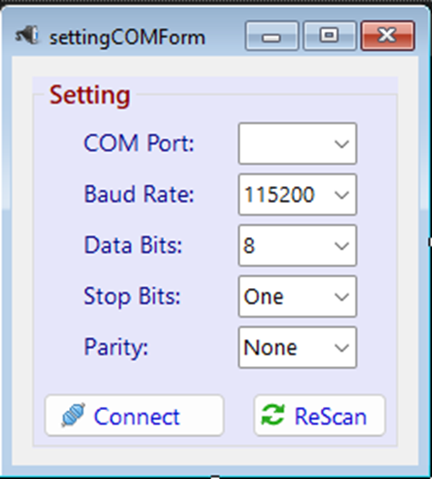
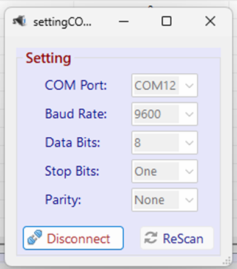

### CardManagerForm
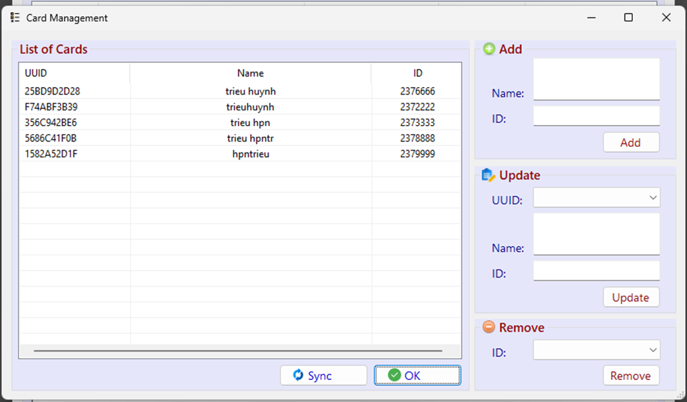

### ReportForm
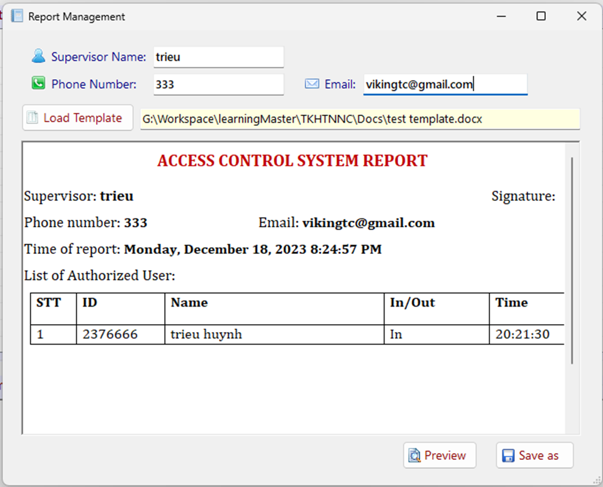
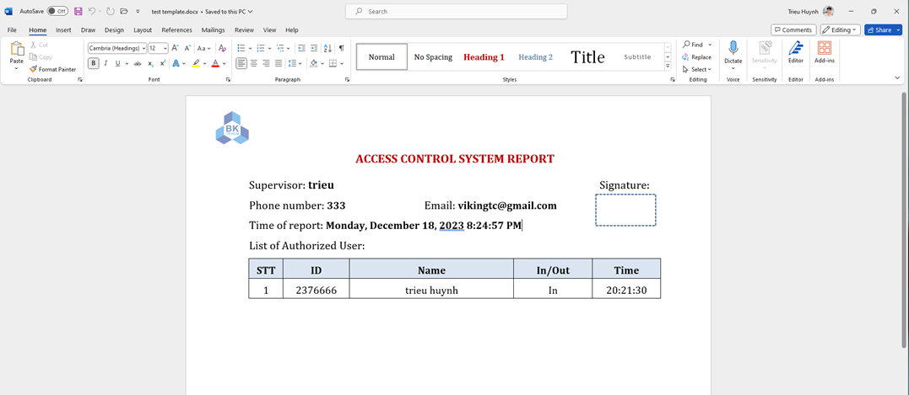

### Task Diagram
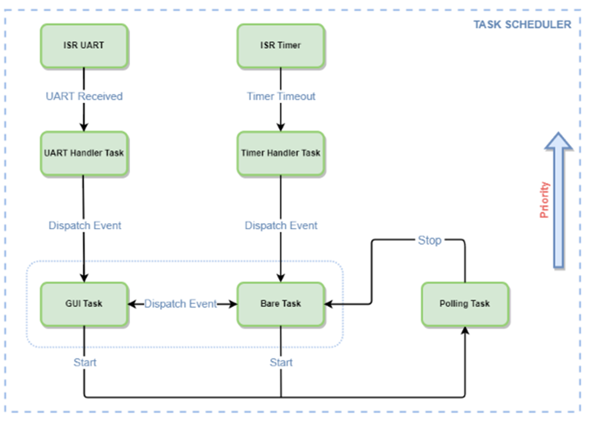

### State Diagram
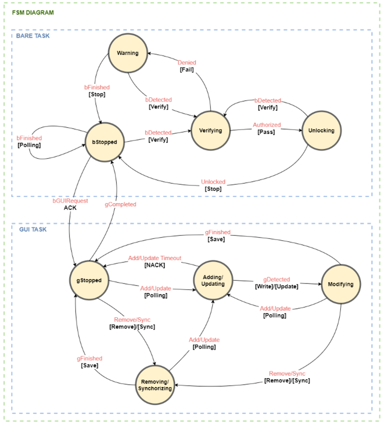
